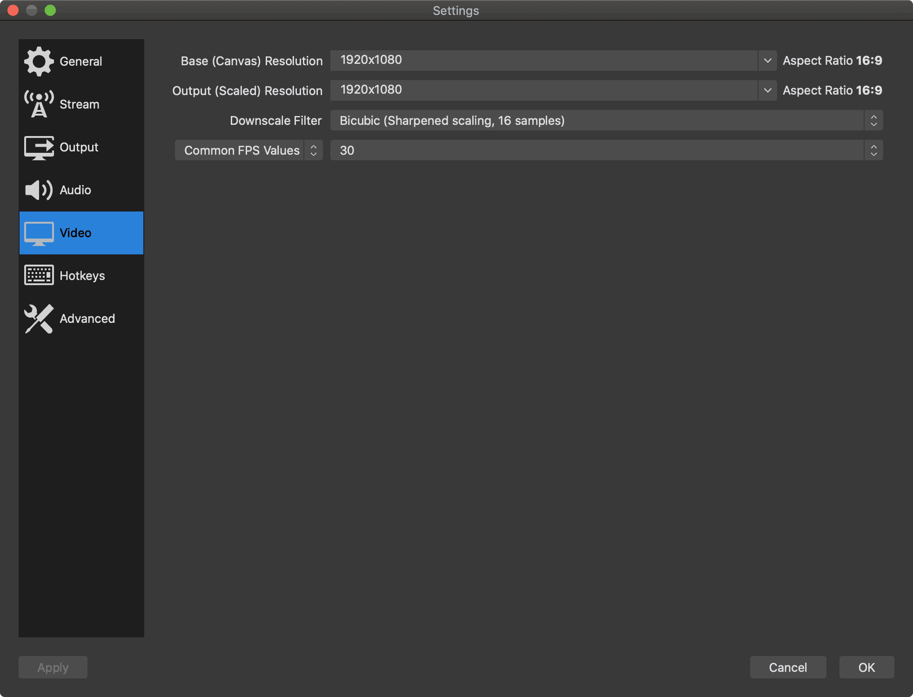
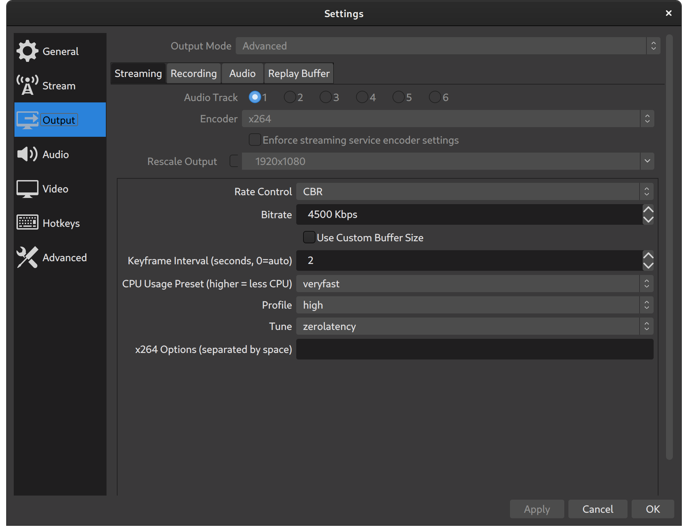

# Streaming Guide

Streamers are the ones that mux everything together out to the internet. Streamers are the folks that are responsible for getting everyone that's joined a Zoom call, adding in any customizations via [OBS](http://obsproject.com/), and streaming that feed out to the internet.

Streamers are the ones that will be making sure the content lands on Twitch/YouTube/Facebook/Twitter/etc.

**Some requirements must be met to stream.**

## Bandwidth

If you have a lower end upload speed, streaming is possible but 720p and 1080p streams require at least 5 Mbps of upload bandwidth. Keep in mind, other things on your network contend for this bandwidth. While we don't intend to stream in 4K, it's worth mentioning, the upload bandwidth requirements for broadcasting 4K video is 25 Mbps.

## Equipment

Keep in mind; you can stream and participate with a wide variety of devices and hardware. What you have right now as someone who participates in meetings remotely regularly likely has good enough equipment to join in a stream. However, some regular streamers will probably be filling a [Guest](README.md#Guests) and/or [Producers](README.md#Producers) role as well. If you don't have enough compute and video power to pull this off, a two computer set up is suggested.

### Two computer set up

Streamers will need to consider how they will both broadcast a stream while participating in it (either in Twitch and/or Zoom). While this is possible with a powerful enough setup, many Streamers choose to use two computers; one to stream the OBS feed and the other to participate in the Zoom call/Twitch.

#### Computer A

Computer A will be the box from which you speak, present, etc. to the audience on the stream. You'll connect to Zoom with this computer and use the microphone and camera on this machine. You will likely have the chat(s) for the streaming platform(s) open here as well.

#### Computer B

Computer B will be the machine that runs [OBS](https://obsproject.com/) to broadcast the Zoom call to the streaming platform(s). This computer should be able to handle the demand of encoding video feeds and streaming them. For example, an 8th generation Intel i3 is the minimum platform being recommended.

The good news is there are other people capable of doing the streaming on your behalf, so do not feel like you have to do it all yourself.

These streamers include:

* @chris-short
* @thoraxe
* TODO: Add more streamers

### Equipment suggestions

With that in mind, if you're going to be a regular [Guest](README.md#Guests) or Streamer we've assembled a list of suggested equipment to help improve the experience for our viewers.

For a tiered list of suggested equipment, see our [Streaming Equipment](pdf/streaming-equipment.pdf) guide.

Twitch also has its own [Hardware Recommendations](https://www.twitch.tv/creatorcamp/en/setting-up-your-stream/hardware-recommendations/) if you'd like to compare options.

There is a good presentation put together by the brand team that will help you make the most of your physical appearance. Ideally, you have a decent mic, good lighting, and are wearing Red Hat or neutrally colored clothing: [Webcam Video
Best practices for presentations](https://docs.google.com/presentation/d/1xnW3hm-jDfwrqma-1j8vzmq4an1mJMk0Y2hQfUkKss4/edit#slide=id.g547716335e_0_260) (Red Hat only).

TODO: open source this guide or some version of it

## OBS

[OBS](https://obsproject.com/), short for Open Broadcaster Software, is an open source project designed to making streaming easier and more professional looking. OBS is the interface to streaming services like Twitch, YouTube, etc. There are a number of useful resources across the web to help you get up and running with OBS or one of its forks. We'll provide the best here along with specific configuration settings that are needed.

All assets that are consumed by OBS for the stream are in the [**streaming-tools**](https://github.com/cloud-platforms-streaming/streaming-tools) repo

### OBS Resources

* [OBS Forum Resources](https://obsproject.com/forum/resources/)
* [General Performance And Encoding Issues](https://obsproject.com/wiki/General-Performance-and-Encoding-Issues)

### OBS Scene Creation

#### Cropping

Cropping inputs is something that you'll find yourself doing quite a bit of in OBS as you're building scenes. The "ALT crop" (Option key on Macs) is a great way to get a crop *just right*. When editing a source, hold the ALT (Option on Mac) key and grab any point in the frame to crop it to suit the scene. Once you have your crop just right, it's encouraged that you do a "Fit to Screen" (CTRL/CMD+F) to make sure the crop is the best you can make it.

For those comfortable with photo editing, this might feel a little awkward, but the outcome is similar. You might notice a black box (letterboxing) around your object as you're positioning it. This is due to the resulting image not fitting the aspect ratio of the screen being streamed. Keeping crops at a 16:9 aspect ratio will help with black boxes.

* [How To CROP, RESIZE And STRETCH In OBS Studio! Easy (YouTube)](https://youtu.be/qEKBaeTJfpc)

### OBS Settings (aka problems and how to fix them)

#### Video Settings

**Broadcasting in 1080p at 30 fps** is the goal. To get that set up, Open Settings, Video. Then make sure the settings are for 1920x1080 and 30 fps.

#### x264 CPU Usage Preset

You should be using a setting of veryfast, superfast, or ultrafast. The higher the setting the better performance. But, the lower the quality too. This is device-specific; testing is required. "The image may look a bit blockier or pixelated, but you will be able to retain your resolution/fps."

#### Sound Settings

TODO: Dependent on setup to an extent too.

#### Error: `Encoding overloaded! Consider turning down the video settings of using a faster preset.`

This is a common error usually related to the stress that video encoding is putting on the system.

Downscaling the output resolutions to 720p is the biggest thing that can be done to fix this. This is a huge sacrifice to video quality though. Try to see if there are updated drivers available for your system. At the very least, reach out to @chris-short for help here.

TODO:

* Streaming key acquisition
* Scenes and more assets (D. Russo helping with animations)
* Add more resources, hints, and refined settings